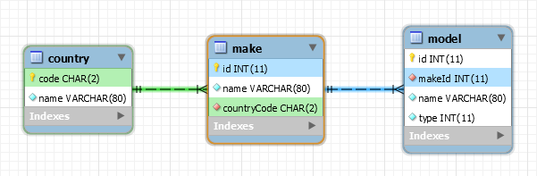

# Cars API
This project is designed to keep track of makes and models of cars.  Details:

* Written in Java
* Built with Maven
* Runs an embedded [Jetty](http://www.eclipse.org/jetty/) web server
* Exposes a REST HTTP API using JAX-RS [Jersey](https://jersey.java.net/)
* Stores data in [MySQL](https://www.mysql.com/)

## Motivation

I wanted to build a REST web service in Java.

# Getting started

1. Install a Java Virtual Machine (JVM) J2SE 1.8
2. Install Maven
3. Setup a config.properties file

## API

### Countries (read-only)

* GET /country - list of all countries
* GET /country/{code} - details of a single country
* GET /country/{code}/make - list of makes from the specified country

### Makes

* GET /make - list of all makes
* GET /make/{id} - details of a single make
* GET /make/{id}/model - list of models produced by the specified make
* DELETE /make/{id} - delete a make
* POST /make - insert a new make (args: name, countryCode)

### Models

* GET /model - list of all models
* GET /model/{id} - details of a single model
* GET /model/type/{type} - list of models of the specified type
* DELETE /model/{id} - delete a model
* POST /model - insert a new model (args: makeId, name, type)

## Database

The database schema can be found in schema.sql.  And example data can be found
in data.sql.

